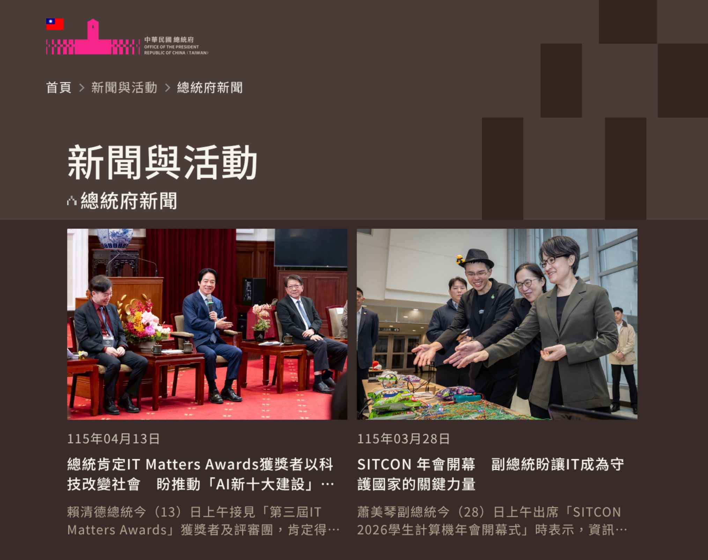
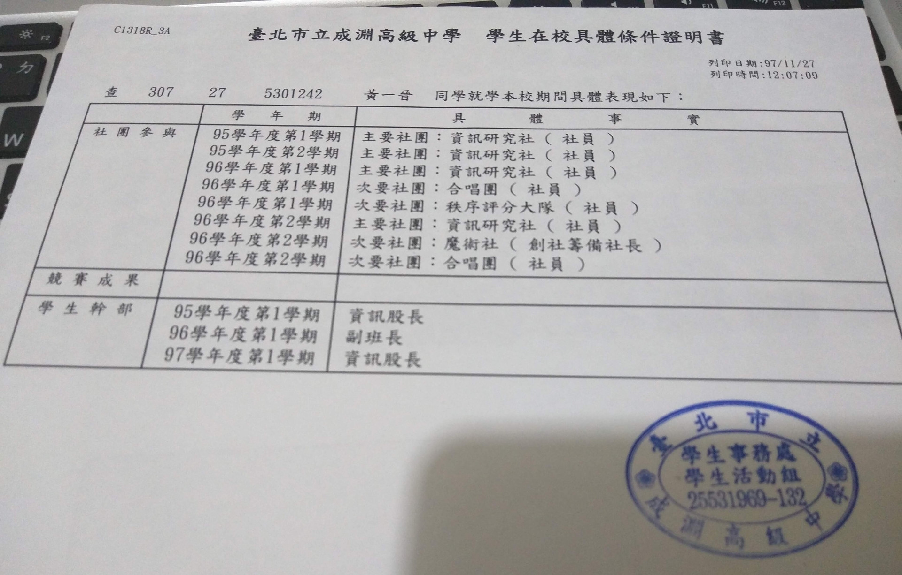
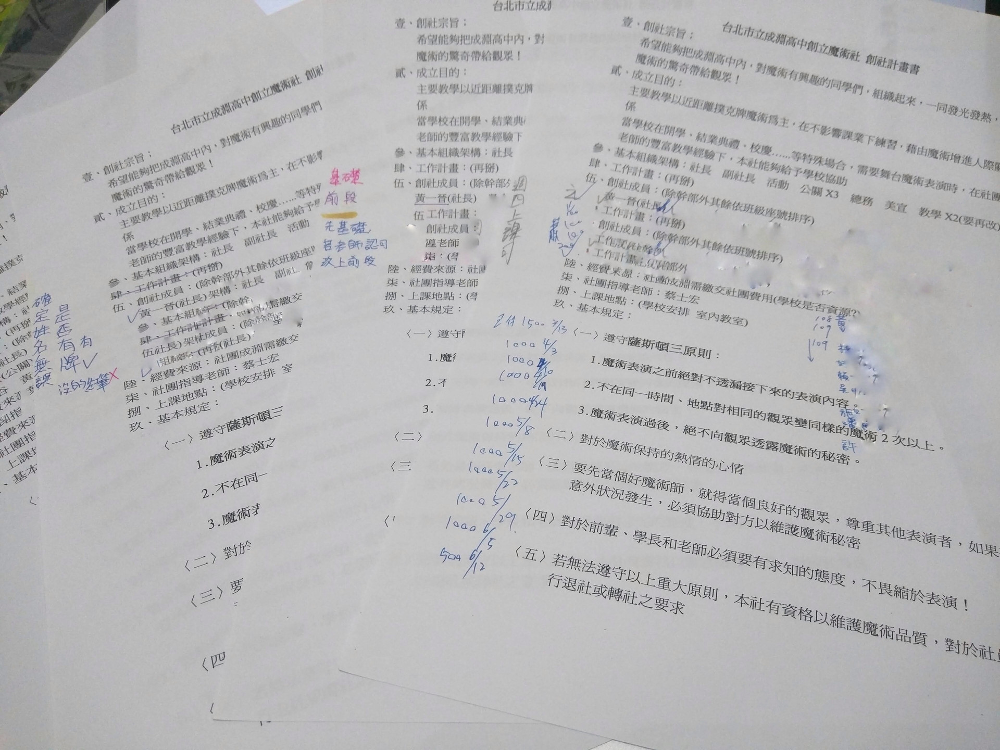
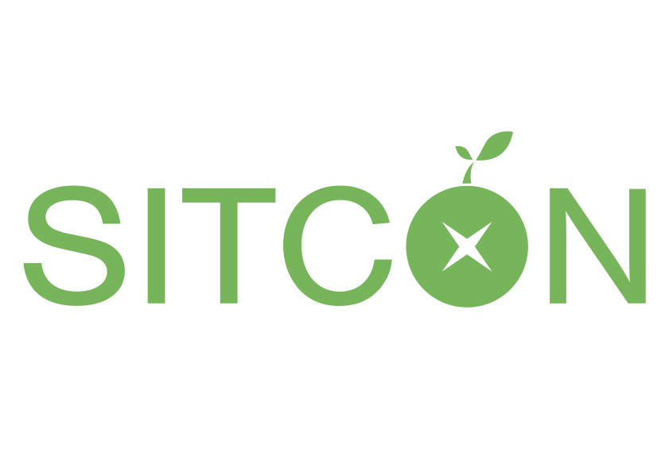
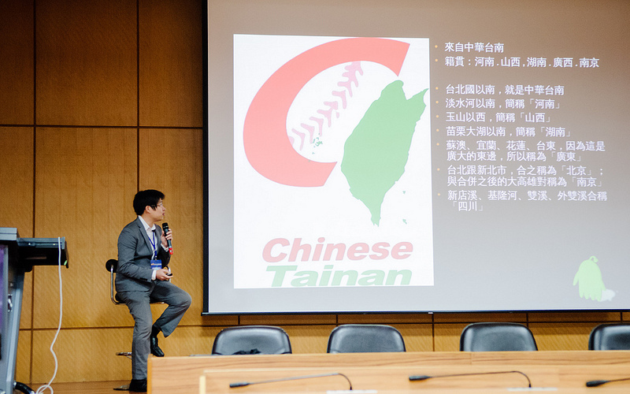
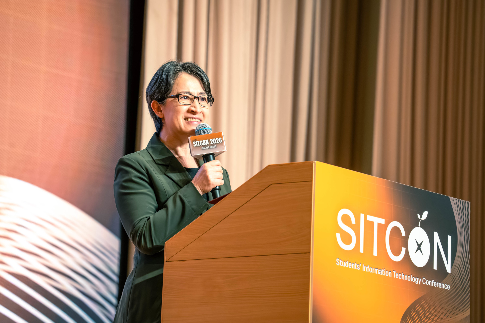

<!-- Google tag (gtag.js) -->

<!-- _paginate: false -->

# 創社團、玩社群，這其中或許做對了什麼？

 
 
 

## Denny Huang
### 2026/04/17 @成淵高中

---

# [https://denny.one/20260417-cyhs](https://denny.one/20260417-cyhs)

---

# Denny Huang

- 成淵 11 屆，魔術社創社籌備社長
- <a href="https://sitcon.org/" target="_blank">SITCON 學生計算機年會</a> 共同發起人
- <a href="https://coscup.org/" target="_blank">COSCUP 開源人年會</a> 長期志工
- <a href="https://hitcon.org/" target="_blank">HITCON 台灣駭客年會</a>  長期志工
- 曾任雷亞遊戲（Rayark Inc.） 資料分析團隊主管
- 開放原始碼/資訊安全社群活躍參與者
- <a href="https://denny.one/" target="_blank">About me</a>

---

---

---

---

# 為什麼創社團？

---

---

# 第一份打工

---

# [SITCON 學生計算機年會](https://denny.one/Intro-SITCON/)

---

# 緣起
## https://hackmd.io/@SITCON/2nd-anniv

---

# COSCUP
## 開源人年會

---

---

# 2012 / 08 / 26

---

## Students’ Information Technology Conference
## https://sitcon.org

---

# 給學生一個發表的舞台。

---

# 研討會
## Since 2013
## 200 人 -> 1300 人

---

---

---

---

---

# 讓一群熱愛資訊的人有交流的機會。

---

---

---

# [SITCON 社群指南](https://sitcon.org/community-guide/)

---

# [SITCON 新人手冊](https://sitcon.org/join)

---

# [開源社群推廣目錄](https://sitcon.org/community-list)

---

# 2026 年的今天，你該如何與 AI 共事
- 審慎查證，如果有不肯定的資訊請上網查詢，若沒辦法完全肯定請告訴我確認的事實，以及哪些是你的推測
- 我們的討論當中請給我多方觀點，讓我能夠權衡多方利害關係人關係

---

# Q & A

---

# Thanks for listening

 
 

###### 本投影片採用
 <a href="https://creativecommons.org/licenses/by-sa/4.0/deed.zh-hant" target="_blank">創用 CC「姓名標示-相同方式分享 4.0 國際」授權條款</a>釋出
 <a href="https://marp.app/" target="_blank">Marp</a> 製作
